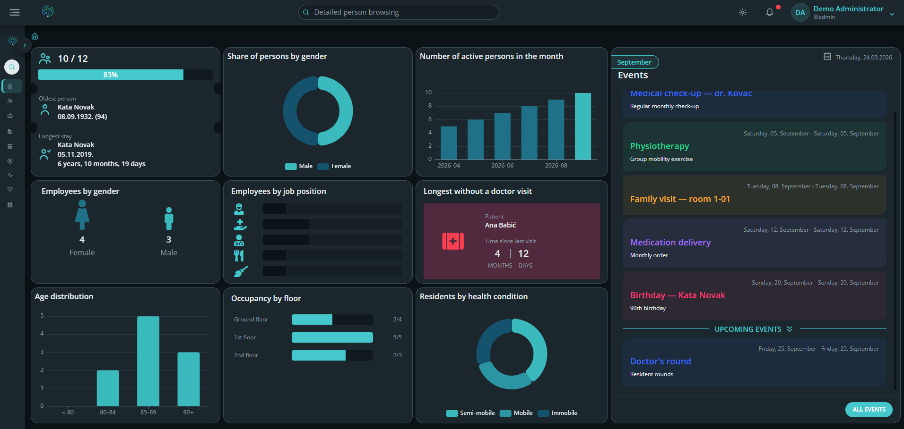
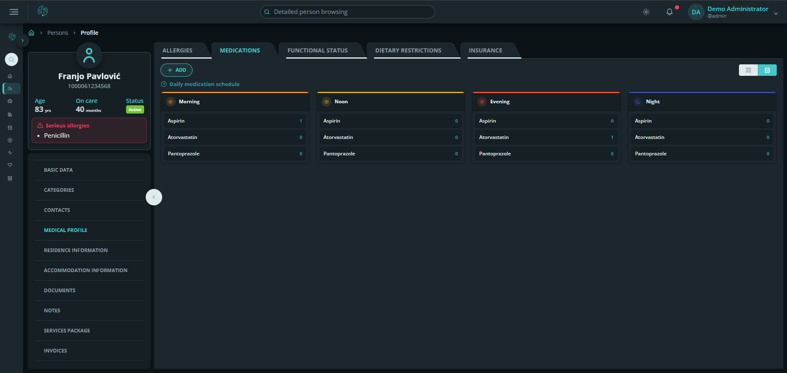
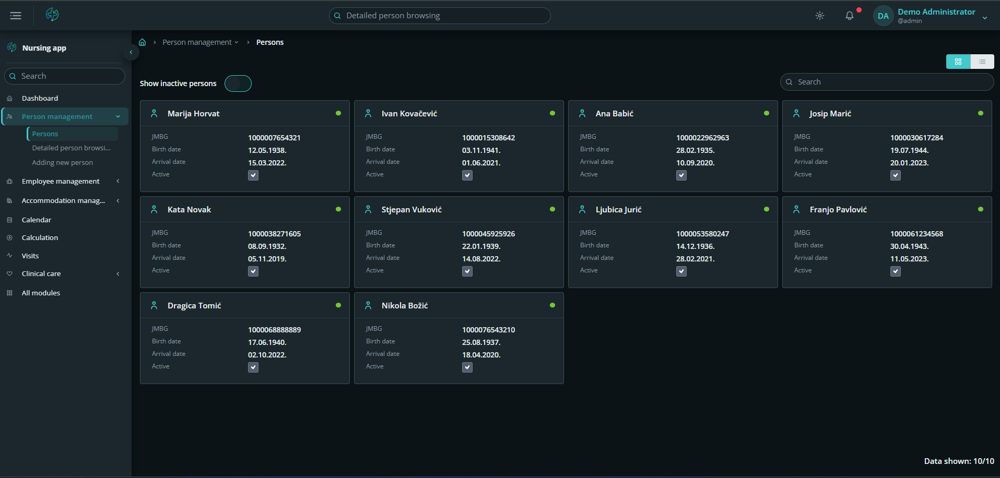
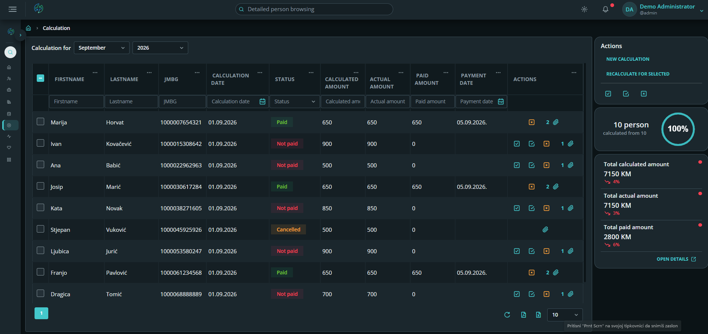
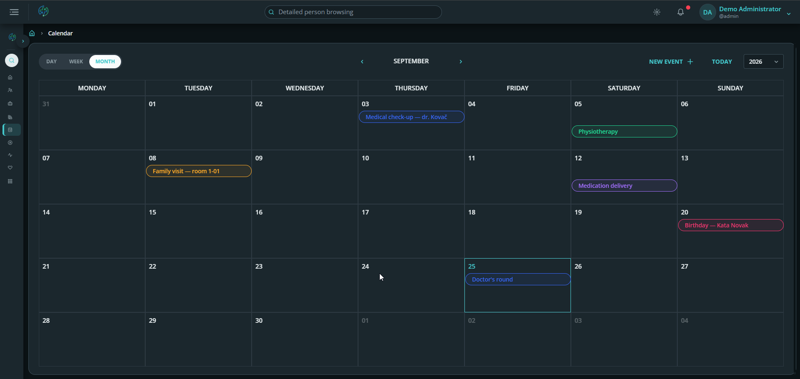
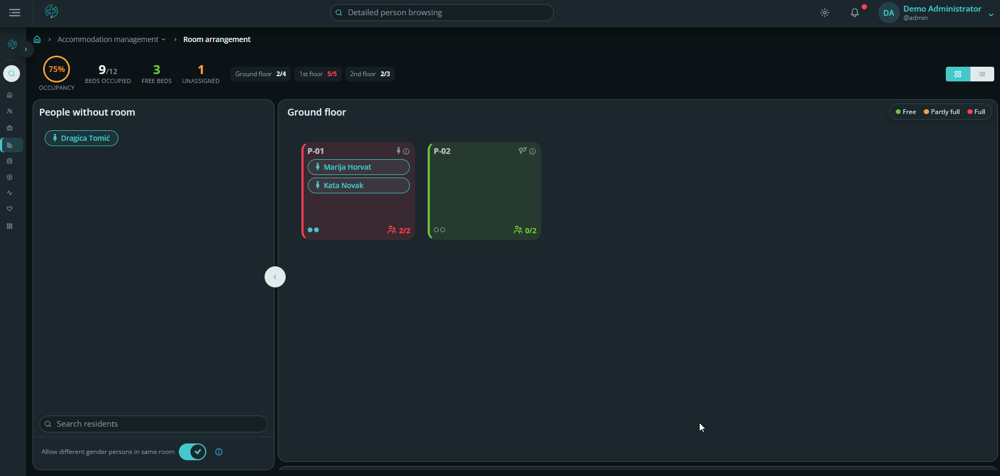
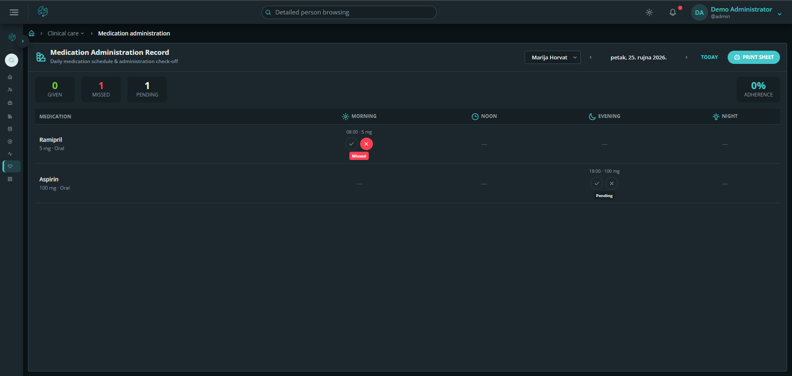
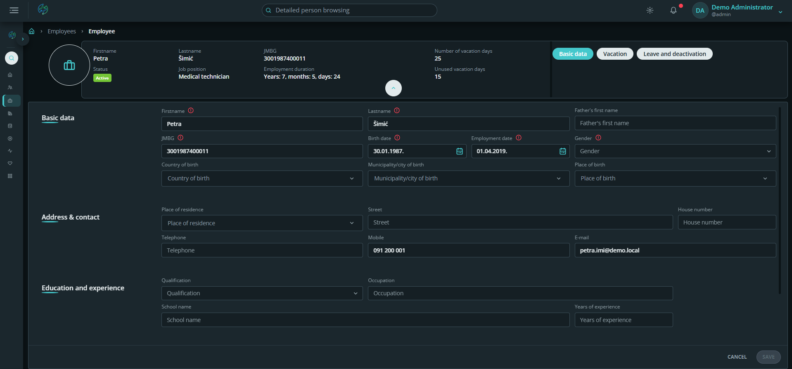
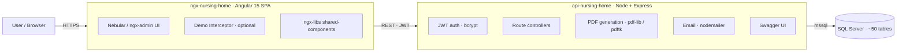

<!-- Screenshots referenced below live in docs/screenshots/. See docs/screenshots/README.md for the shot-list. -->

<h1 align="center">🏡 Nursing Home Management System</h1>

<p align="center">
  A full-stack management platform for residential care homes — residents, medical records,
  billing, scheduling and facility management in one system.
</p>

<p align="center">
  
  
  
  
  
  
  <br>
  <a href="https://ilisevicirena.github.io/nursing-home/"></a>
  <a href="https://github.com/ilisevicirena/nursing-home/actions/workflows/deploy-pages.yml"></a>
</p>

<p align="center">
  <a href="#-live-demo"><b>Live Demo</b></a> ·
  <a href="#-screenshots">Screenshots</a> ·
  <a href="#-features">Features</a> ·
  <a href="#-architecture">Architecture</a> ·
  <a href="#-tech-stack">Tech Stack</a> ·
  <a href="#-getting-started">Getting Started</a>
</p>

---

## 📖 Overview

**Nursing Home** is a production-style web application that digitises the day-to-day operations of a
residential care facility. It brings together the things a care home actually runs on — resident
records and medical profiles, medication and allergy tracking, doctor-visit tours, billing with
discounts and packages, a shared calendar, and room/furniture management — behind a single
role-secured interface.

It is built as three cleanly separated tiers (Angular SPA · Node/Express REST API · SQL Server),
plus a reusable in-house Angular component library.

> **Author:** Irena Ilišević · Full-stack developer
> Designed, built and maintained solo — frontend, backend, data model and reusable component library.

---

## 🚀 Live Demo

> ### ▶ **[ilisevicirena.github.io/nursing-home](https://ilisevicirena.github.io/nursing-home/)**

The public demo runs in **Demo Mode**: a self-contained build of the Angular frontend that serves
realistic seeded data from an in-memory store — **no backend or database required**. It is always-on,
loads instantly, and lets you click through the whole UI. No real personal data is used. It deploys
automatically to GitHub Pages via GitHub Actions on every push.

**Sign in** with any of the demo roles below — the **password can be anything** (Demo Mode accepts all logins):

| Sign-in name | Role | What you'll see |
|---|---|---|
| `admin` | Administrator | Full access — all modules, users and settings |
| `nurse` · `doctor` · `caregiver` | Clinical / care staff | Staff dashboard, residents and clinical care |
| `user` | Family / guardian | Read-only view limited to their own residents in care |

<p align="center">
  
</p>

> 💡 Tip: try the same screens as `admin` vs `user` to see role-based access in action.

---

## 📸 Screenshots

<p align="center">
  <br>
  <em>Dashboard — occupancy, key metrics and quick actions</em>
</p>

<p align="center">
  <br>
  <em>Medical profile — medications, allergies &amp; clinical data</em>
</p>

<table>
  <tr>
    <td width="50%"><br><em>Resident directory &amp; profiles</em></td>
    <td width="50%"><br><em>Billing — calculations, discounts &amp; packages</em></td>
  </tr>
  <tr>
    <td width="50%"><br><em>Calendar &amp; doctor-visit scheduling</em></td>
    <td width="50%"><br><em>Room arrangement — drag-and-drop occupancy board</em></td>
  </tr>
  <tr>
    <td width="50%"><br><em>Medication Administration Record (MAR)</em></td>
    <td width="50%"><br><em>Employee profile — role, contact &amp; details</em></td>
  </tr>
</table>

---

## ✨ Features

### 🧑‍🦳 Residents & medical care
- Resident directory with full personal & contact records
- Medical profile per resident — diagnoses, functional status, insurance
- **Medication management** with dosing schedules
- **Allergy tracking** with allergen catalogue and severity levels
- Dietary requirements & accommodation types
- Care notes and audit trail

### 🩺 Clinical scheduling
- **Doctor-visit tours** — plan rounds, assign employees and residents
- Shared **calendar** with typed events
- Visit history per resident

### 💶 Billing & documents
- **Calculations** (invoices) with line items, statuses and history
- Discounts, service packages and package relations
- **PDF generation** — printable invoices and filled document templates
- Document repository

### 🏢 Facility & staff
- **Room & accommodation management**, furniture inventory and statuses
- Employee directory and profiles with role-based access
- Cities / municipalities / contacts master data

### 🔐 Platform
- **JWT authentication** with bcrypt-hashed passwords and password-reset by email
- **Swagger / OpenAPI** documentation for every endpoint
- Advanced search, notifications and configurable dashboards
- Structured logging (entity/type/log tables)
- Internationalisation-ready (`@angular/localize`)

---

## 🏗 Architecture



**Repository layout**

```
nursing-home/
├─ ngx-nursing-home/   # Angular 15 frontend (Nebular UI, ~40 feature modules)
├─ api-nursing-home/   # Node/Express REST API (JWT, Swagger, PDF, email)
├─ db-nursing-home/    # SQL Server schema + seed scripts + build tooling
└─ docs/               # Screenshots, diagrams, docs
```

The reusable UI library lives in a separate repository, [`ngx-libs`](https://github.com/ilisevicirena),
and is consumed by the frontend as a package.

---

## 🛠 Tech Stack

| Layer | Technologies |
|---|---|
| **Frontend** | Angular 15, TypeScript, Nebular / ngx-admin, RxJS, Bootstrap 5, SCSS |
| **Data viz** | ECharts, Chart.js, Leaflet maps |
| **Documents** | jsPDF, html-to-pdfmake, html2canvas |
| **Backend** | Node.js, Express, JWT, bcryptjs, Swagger (OpenAPI) |
| **Documents (server)** | pdf-lib, pdftk, fill-pdf, nodemailer |
| **Database** | Microsoft SQL Server (`mssql`), ~50 relational tables |
| **Tooling** | Angular CLI, ESLint, Stylelint, Compodoc, PowerShell/Python DB build scripts |

---

## ⚡ Getting Started

### Prerequisites
- Node.js 18+ and npm
- SQL Server (local, Docker, or Azure SQL)

### 1. Database
```powershell
cd db-nursing-home
cp db.config.example.ps1 db.config.ps1   # set your server/credentials
./create-full-db-en.ps1                   # creates schema + seed data
```

### 2. API
```bash
cd api-nursing-home
cp .env.example .env                      # set DB connection, JWT secret, SMTP
npm install
npm start                                 # http://localhost:3000  ·  /api-docs for Swagger
```

### 3. Frontend
```bash
cd ngx-nursing-home
npm install
npm start                                 # http://localhost:4200
```

### Demo Mode (no backend/DB)
```bash
cd ngx-nursing-home
npm run start:demo                         # serves the app with seeded in-memory data
```
Demo Mode is toggled by a build flag and an HTTP interceptor (`src/app/@core/demo/`), so it is fully
isolated from the real application code.

---

## 📜 License & Usage

**© 2026 Irena Ilišević. All rights reserved.**

This repository is published **as a portfolio showcase**. You may view it to evaluate the author's
work. You may **not** copy, reuse, redistribute, or create derivative works from any part of it,
in whole or in part, without prior written permission. See [LICENSE](LICENSE).

---

## 👤 Contact

**Irena Ilišević** — Full-stack developer
📧 irenailisevic@gmail.com · [GitHub](https://github.com/ilisevicirena)
